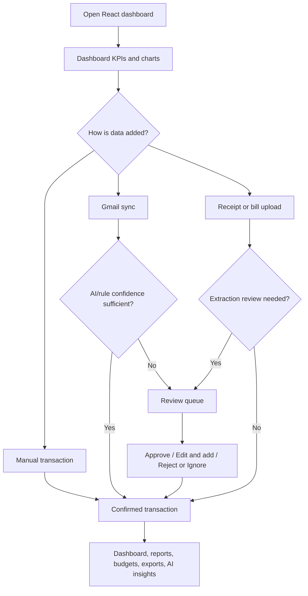
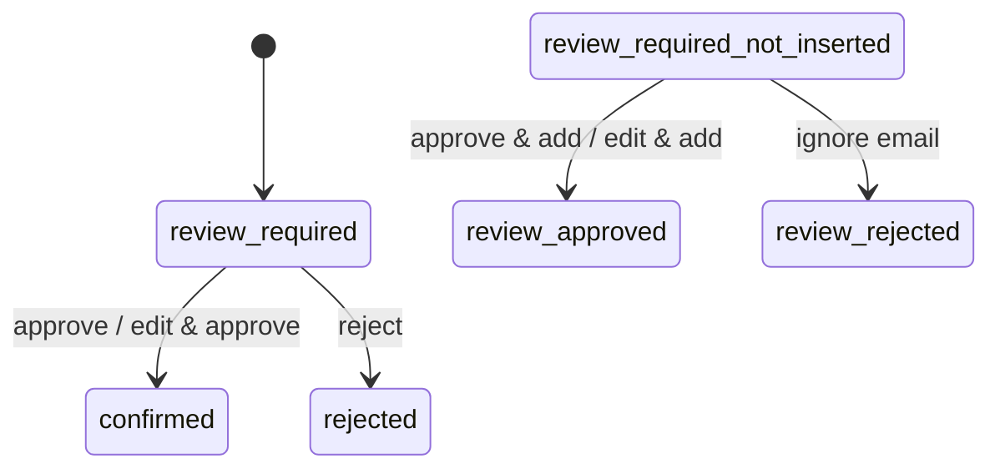

# Application Flow

## Primary user flow

## Gmail flow

1. User connects Gmail through `/auth/google`.
2. The callback stores encrypted token data and attempts to record the connected Gmail address.
3. Manual sync calls `POST /gmail/sync`; scheduled sync calls the same service while the backend is running.
4. The system searches transaction-like emails, applies rule parsing, then optional AI analysis.
5. High-confidence valid records become confirmed transactions.
6. Low-confidence candidates are stored as `review_required_not_inserted` Gmail logs with a safe proposed transaction.
7. The user resolves those logs from Dashboard; approval creates a confirmed transaction, rejection ignores the email.

## Review flow

## Report flow

1. User selects all time, one month, or a custom inclusive date range.
2. React requests `/dashboard/summary` with the applicable query parameters.
3. Backend calculates income, expenses, investments, refunds, transfers, net cash flow, trends, categories, and merchants.
4. Custom ranges intentionally do not display a monthly budget performance value.

## Navigation

- Dashboard: current financial position, charts, budget, review queue, Gmail activity, AI insights.
- Transactions: create/search/filter/page transaction ledger.
- Reports: period analysis, budget performance, category/trend breakdowns, exports.
- Profile: private preferences and Gmail scheduling preference.
- Settings: configured AI provider and safe connectivity test.
- Help: product guidance and FAQs.
